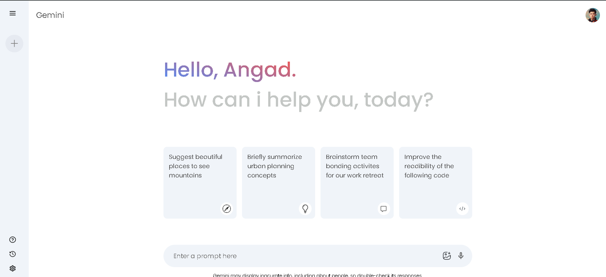

# Gemini AI Clone  

An AI-powered chat application inspired by Google Gemini, built with **React.js, Node.js, and TypeScript**.  
The app allows users to interact with an LLM-powered chatbot in real time, with smooth conversation history and a responsive UI.  

---

## 🚀 Live Demo  
[Demo Link (if deployed on Vercel/AWS)](https://your-deployment-link.com)  

---

## 📸 Preview  
  

---

## 🛠 Tech Stack  
- **Frontend:** React.js, TypeScript, Tailwind CSS  
- **Backend:** Node.js, Express.js  
- **AI:** LLM API (Gemini / OpenAI)  
- **Deployment:** Vercel / AWS  
- **State Management:** React Hooks, Context API  

---

## ✨ Features  
- Real-time chat with AI (streaming responses)  
- Conversation history with context retention  
- Responsive, mobile-first design with Tailwind CSS  
- Modular React components for scalability  
- Error/loading states for smooth UX  

---

## ⚡ Getting Started  

Clone the repo and install dependencies:  
```bash
git clone https://github.com/ramanngartan/gemini-clone.git
cd gemini-clone-src
npm install
npm run dev
